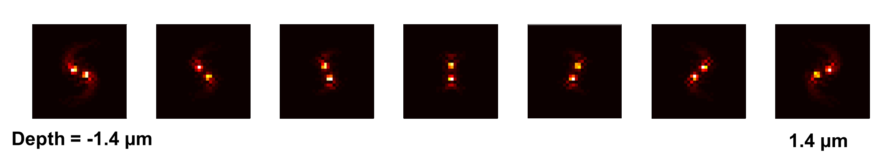

# ADMM_3D_deconvolution
This repository contains a demonstration of 3D deconvolution using ADMM algorithm. 

Run the script of 
```
Main_demo.m 
```
to test the 3D deconvolution using ADMM algorithm. 

# Loading dictionary matrix
The first step is to load the data containing the dictionary matrix contining different PSFs at different depthes.
In the code the dictionary matrix dimension is 96X96X21, which means it contains 21 different layers.
Here we only show 7 different layers in low resolution. 



# Loading 2D images to be recovered

The second step is to load the 2D raw data containing the PSFs at different layers. 


# 3D Deconvolution from 2D image 

The final step is to deconvolve the 2D image using 3D matrix; extracting information from additional dimension. 


